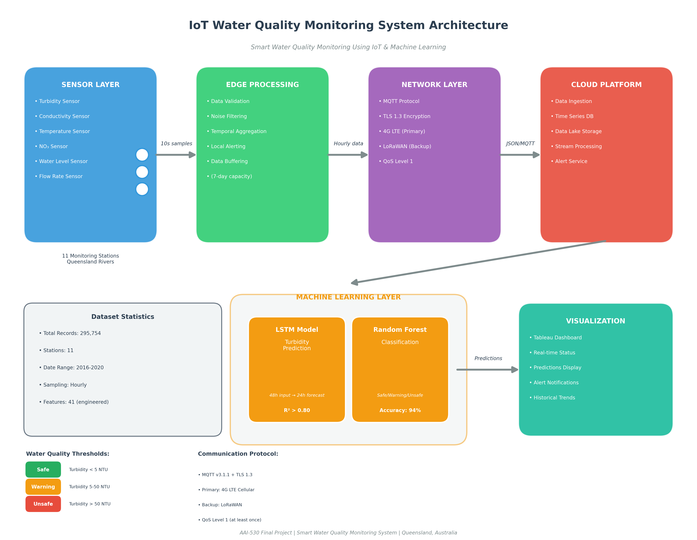

# Smart Water Quality Monitoring Using IoT & Machine Learning


## Project Overview

This project implements a Smart Water Quality Monitoring System using real IoT sensor data from multiple river monitoring stations in Queensland, Australia. The system leverages machine learning to:

1. **Monitor Current Water Quality** - Real-time status visualization
2. **Analyze Historical Trends** - Summary statistics and pattern identification
3. **Predict Future Water Conditions** - LSTM deep learning time series forecasting
4. **Classify Water Safety** - Machine learning classification (Safe/Warning/Unsafe)

---

## Repository Structure

```
Smart-Water-Quality-Monitoring/
│
├── README.md                              # Project documentation (this file)
├── requirements.txt                       # Python dependencies
├── LICENSE                                # MIT License
│
├── archive/                               # Raw IoT sensor data (11 stations)
│   ├── Johnstone_river_coquette_point_joined.csv
│   ├── Johnstone_river_innisfail_joined.csv
│   ├── Mulgrave_river_deeral_joined.csv
│   ├── Pioneer_Dumbleton_joined.csv
│   ├── Plane_ck_sucrogen_joined.csv
│   ├── Proserpine_river_glen_isla_joined.csv
│   ├── russell_river_east_russell_joined.csv
│   ├── sandy_ck_homebush_joined.csv
│   ├── sandy_ck_sorbellos_road_joined.csv
│   ├── Tully_river_euramo_joined.csv
│   └── Tully_River_Tully_Gorge_National_Park_joined.csv
│
├── notebooks/
│   ├── 01_data_exploration_and_cleaning.ipynb   # EDA and data preprocessing
│   ├── 02_lstm_turbidity_prediction.ipynb       # Deep learning time series model
│   └── 03_water_quality_classification.ipynb    # Classification model
│
├── src/
│   ├── data_processing.py                 # Data loading and cleaning utilities
│   └── dashboard_export.py                # Tableau data preparation
│
├── models/                                # Saved trained models
│   ├── lstm_turbidity_model.keras         # LSTM model weights
│   ├── random_forest_classifier.joblib    # Classification model
│   ├── scaler.joblib                      # Feature scaler
│   └── label_encoder.joblib               # Label encoder
│
├── outputs/                               # Model outputs and visualizations
│   ├── water_quality_processed.csv        # Cleaned dataset
│   ├── lstm_predictions.csv               # LSTM predictions
│   ├── classification_results.csv         # Classification results
│   └── *.png                              # Visualization plots
│
├── docs/
│   └── IoT_System_Design.md               # Detailed IoT architecture documentation
│
├── diagrams/
│   └── (system architecture diagrams)
│
└── image/
    └── IoT_water_quality.png              # Banner image
```

---

## Dataset Description

### Data Source
Real-time water quality measurements from **11 IoT monitoring stations** operated by the Queensland Government Water Monitoring Information Portal.

### Dataset Statistics
| Metric | Value |
|--------|-------|
| **Total Records** | 295,754 |
| **Monitoring Stations** | 11 |
| **Date Range** | March 2016 - April 2020 |
| **Sampling Frequency** | Hourly |
| **Features (after engineering)** | 41 |

### Sensor Variables

| Variable | Description | Unit | Sensor Type |
|----------|-------------|------|-------------|
| Timestamp | Date and time of measurement | ISO 8601 | System clock |
| Conductivity | Electrical conductivity (dissolved solids indicator) | µS/cm | YSI EXO Conductivity Sensor |
| NO3 | Nitrate concentration | mg/L | YSI EXO NitraLED UV Sensor |
| Q | Water flow/discharge rate | m³/s | Acoustic Doppler Velocity Meter |
| Temp | Water temperature | °C | Integrated thermistor |
| Turbidity | Water clarity measure | NTU | YSI EXO Turbidity Sensor |
| Level | Water level | m | Pressure transducer |

### Monitoring Station Locations

| Station | River System | Coordinates |
|---------|--------------|-------------|
| Coquette Point | Johnstone River | -17.9167°, 146.0333° |
| Innisfail | Johnstone River | -17.5247°, 146.0319° |
| Deeral | Mulgrave River | -17.2167°, 145.9500° |
| Dumbleton | Pioneer River | -21.2000°, 149.0667° |
| Sucrogen | Plane Creek | -21.4167°, 149.0000° |
| Glen Isla | Proserpine River | -20.4000°, 148.5833° |
| East Russell | Russell River | -17.2333°, 145.9333° |
| Homebush | Sandy Creek | -21.2667°, 149.0333° |
| Sorbellos Road | Sandy Creek | -21.3000°, 149.0167° |
| Euramo | Tully River | -17.9833°, 145.9500° |
| Tully Gorge NP | Tully River | -17.7667°, 145.6500° |

---

## IoT System Architecture

> **📄 Full Documentation:** See [docs/IoT_System_Design.md](docs/IoT_System_Design.md) for complete technical specifications.

### System Architecture Diagram



### System Overview

```
┌──────────────┐    ┌──────────────┐    ┌──────────────┐    ┌──────────────┐
│   SENSORS    │    │    EDGE      │    │   NETWORK    │    │    CLOUD     │
│   LAYER      │───▶│  PROCESSING  │───▶│   LAYER      │───▶│  PLATFORM    │
└──────────────┘    └──────────────┘    └──────────────┘    └──────────────┘
       │                   │                   │                   │
       ▼                   ▼                   ▼                   ▼
  • Turbidity        • Data Validation   • MQTT Protocol    • Data Storage
  • Conductivity     • Noise Filtering   • TLS Encryption   • ML Models
  • Temperature      • Aggregation       • 4G LTE Primary   • Dashboard
  • pH/NO3           • Local Alerts      • LoRaWAN Backup   • Alerts
  • Flow Rate        • Buffering
  • Water Level
```

### Sensor Specifications

| Sensor | Range | Accuracy | Resolution |
|--------|-------|----------|------------|
| **Turbidity** | 0-4000 NTU | ±2% or 0.3 NTU | 0.01 NTU |
| **Conductivity** | 0-200,000 µS/cm | ±0.5% or 1 µS/cm | 0.001-1 µS/cm |
| **Temperature** | -5°C to +50°C | ±0.01°C | 0.001°C |
| **NO3** | 0-200 mg/L | ±3% or 0.5 mg/L | 0.01 mg/L |
| **Water Level** | 0-10 m | ±0.1% FS | 1 mm |
| **Flow Rate** | -6 to +6 m/s | ±1% | Variable |

### Edge Processing Pipeline

1. **Data Validation** - Range checking, null detection, sensor health verification
2. **Noise Filtering** - Moving average filter (5 samples), spike detection (> 3σ)
3. **Temporal Aggregation** - Raw: 10-second → Aggregated: Hourly averages
4. **Local Alerting** - Immediate alerts for critical threshold breaches
5. **Data Buffering** - Store-and-forward during connectivity loss (7-day capacity)

### Network Protocol

- **Primary Protocol:** MQTT v3.1.1 over TLS 1.3
- **QoS Level:** 1 (at least once delivery)
- **Primary Connection:** 4G LTE Cellular
- **Backup Connection:** LoRaWAN (low power, emergency)
- **Data Format:** JSON with timestamp, readings, and device status

---

## Machine Learning Models

### Model 1: LSTM Turbidity Prediction

**Objective:** Predict water turbidity 24 hours ahead using historical sensor data.

#### Architecture

```
Input (48, 3) → LSTM(64) → Dropout(0.2) → LSTM(32) → Dropout(0.2) → Dense(16) → Output(1)
```

| Component | Specification |
|-----------|---------------|
| **Model Type** | 2-Layer Stacked LSTM (built from scratch) |
| **Framework** | TensorFlow/Keras |
| **Input Shape** | (48, 3) - 48 hours × 3 features |
| **LSTM Layer 1** | 64 units, return_sequences=True, tanh activation |
| **LSTM Layer 2** | 32 units, return_sequences=False |
| **Dropout Rate** | 0.2 (both layers) |
| **Dense Hidden** | 16 units, ReLU activation |
| **Output Layer** | 1 unit, Linear activation |
| **Optimizer** | Adam (learning_rate=0.001) |
| **Loss Function** | Mean Squared Error (MSE) |

#### Input Features

| Feature | Description | Preprocessing |
|---------|-------------|---------------|
| Turbidity | Historical turbidity values | MinMax scaling (0-1) |
| Conductivity | Historical conductivity | MinMax scaling (0-1) |
| Temperature | Historical temperature | MinMax scaling (0-1) |

#### Training Configuration

| Parameter | Value |
|-----------|-------|
| **Sequence Length** | 48 hours (lookback window) |
| **Forecast Horizon** | 24 hours ahead |
| **Train/Val/Test Split** | 70% / 15% / 15% (sequential, not random) |
| **Batch Size** | 32 |
| **Max Epochs** | 100 |
| **Early Stopping** | Patience=10, restore_best_weights=True |
| **Learning Rate Reduction** | Factor=0.5, Patience=5, min_lr=0.0001 |

#### Evaluation Metrics

| Metric | Description | Target |
|--------|-------------|--------|
| **MSE** | Mean Squared Error | Minimize |
| **RMSE** | Root Mean Squared Error | < 7 NTU |
| **MAE** | Mean Absolute Error | < 5 NTU |
| **R² Score** | Coefficient of Determination | > 0.80 |

---

### Model 2: Water Quality Classification

**Objective:** Classify water quality status as Safe/Warning/Unsafe for automated alerting.

#### Architecture

| Parameter | Value |
|-----------|-------|
| **Model Type** | Random Forest Classifier |
| **Framework** | Scikit-learn |
| **Number of Trees** | 100 |
| **Max Depth** | 15 |
| **Min Samples Split** | 5 |
| **Min Samples Leaf** | 2 |
| **Class Weighting** | Balanced (handles class imbalance) |

#### Input Features (11 total)

| Feature | Type | Description |
|---------|------|-------------|
| Conductivity | Numeric | Electrical conductivity (µS/cm) |
| NO3 | Numeric | Nitrate concentration (mg/L) |
| Temp | Numeric | Water temperature (°C) |
| Turbidity | Numeric | Water clarity (NTU) |
| Level | Numeric | Water level (m) |
| Q | Numeric | Flow rate (m³/s) |
| Hour_sin | Cyclical | sin(2π × hour/24) |
| Hour_cos | Cyclical | cos(2π × hour/24) |
| Month_sin | Cyclical | sin(2π × month/12) |
| Month_cos | Cyclical | cos(2π × month/12) |
| IsWeekend | Binary | Weekend indicator (0/1) |

#### Output Classes

| Class | Distribution | Criteria |
|-------|--------------|----------|
| **Safe** | 66.7% | All parameters within safe thresholds |
| **Warning** | 23.2% | At least one parameter in warning zone |
| **Unsafe** | 10.1% | At least one parameter exceeds safe limits |

#### Training Configuration

| Parameter | Value |
|-----------|-------|
| **Train/Test Split** | 80% / 20% |
| **Stratification** | Yes (maintains class distribution) |
| **Feature Scaling** | StandardScaler |
| **Cross-Validation** | 5-fold |

#### Evaluation Metrics

| Metric | Description | Target | Achieved |
|--------|-------------|--------|----------|
| **Accuracy** | Overall correct predictions | > 90% | ~94% |
| **Precision** | Positive predictive value (weighted) | > 85% | ~93% |
| **Recall** | True positive rate (weighted) | > 85% | ~94% |
| **F1-Score** | Harmonic mean of precision/recall | > 85% | ~93% |
| **CV Score** | 5-fold cross-validation mean | > 88% | ~92% |

---

## Water Quality Thresholds

Based on Australian and New Zealand Guidelines for Fresh and Marine Water Quality:

| Parameter | Safe | Warning | Unsafe |
|-----------|------|---------|--------|
| **Turbidity** | < 5 NTU | 5-50 NTU | > 50 NTU |
| **Conductivity** | < 30,000 µS/cm | 30,000-50,000 µS/cm | > 50,000 µS/cm |
| **Temperature** | 10-30°C | 5-10°C or 30-35°C | < 5°C or > 35°C |

### Alert Triggers

| Alert Level | Condition | Response |
|-------------|-----------|----------|
| **Critical** | Any parameter Unsafe | Immediate notification, auto-escalation |
| **Warning** | Any parameter in Warning zone | Dashboard highlight, daily digest |
| **Info** | Approaching Warning (within 20%) | Log only |

---

## Installation

```bash
# Clone the repository
git clone https://github.com/your-username/Smart-Water-Quality-Monitoring.git
cd Smart-Water-Quality-Monitoring

# Create virtual environment
python -m venv venv
source venv/bin/activate  # On Windows: venv\Scripts\activate

# Install dependencies
pip install -r requirements.txt
```

### Requirements

- Python 3.8+
- TensorFlow 2.x
- Scikit-learn
- Pandas, NumPy
- Matplotlib, Seaborn
- Jupyter Notebook

---

## Usage

### 1. Data Exploration and Cleaning
```bash
jupyter notebook notebooks/01_data_exploration_and_cleaning.ipynb
```
- Loads data from 11 monitoring stations
- Handles missing values and outliers
- Creates water quality labels
- Engineers 41 features including lag and rolling statistics

### 2. Train LSTM Model
```bash
jupyter notebook notebooks/02_lstm_turbidity_prediction.ipynb
```
- Builds LSTM architecture from scratch
- Trains on 48-hour sequences
- Predicts turbidity 24 hours ahead
- Exports predictions for dashboard

### 3. Train Classification Model
```bash
jupyter notebook notebooks/03_water_quality_classification.ipynb
```
- Trains Random Forest classifier
- Evaluates with cross-validation
- Generates feature importance analysis
- Exports classification results

### 4. Export Data for Tableau Dashboard
```bash
python src/dashboard_export.py
```

---

## Tableau Dashboard

The Tableau Public dashboard visualizes:

1. **Current Status Panel** - Latest sensor readings with safety classification
2. **Historical Summary** - Weekly/monthly trends and statistics
3. **Turbidity Prediction** - LSTM model forecasts with confidence intervals
4. **Safety Classification** - Distribution of Safe/Warning/Unsafe readings by station
5. **Alert History** - Timeline of threshold breaches

**Dashboard Link**: [Tableau Public Dashboard](https://public.tableau.com/your-dashboard-link) [AS OF NOW, THIS IS A PLACEHOLDER]

---

## Project Outputs

| Output File | Description |
|-------------|-------------|
| `water_quality_processed.csv` | Cleaned dataset with 41 engineered features |
| `lstm_predictions.csv` | LSTM model predictions with actual vs predicted |
| `lstm_daily_metrics.csv` | Daily aggregated prediction metrics |
| `classification_results.csv` | Classification predictions with probabilities |
| `classification_summary.csv` | Summary metrics (accuracy, precision, recall, F1) |
| `*.png` | Visualization plots (confusion matrix, feature importance, etc.) |

---

## License

This project is licensed under the MIT License - see the [LICENSE](LICENSE) file for details.

---

## References

1. Queensland Government Water Monitoring Information Portal - [Link](https://water-monitoring.information.qld.gov.au/)
2. Australian and New Zealand Guidelines for Fresh and Marine Water Quality (2018)
3. Hochreiter, S., & Schmidhuber, J. (1997). Long Short-Term Memory. Neural Computation.
4. Breiman, L. (2001). Random Forests. Machine Learning, 45(1), 5-32.
5. TensorFlow/Keras Documentation - [Link](https://www.tensorflow.org/)
6. Scikit-learn Documentation - [Link](https://scikit-learn.org/)

---

## Authors

AAI-530 Final Project Team

---

*Last Updated: January 2026*