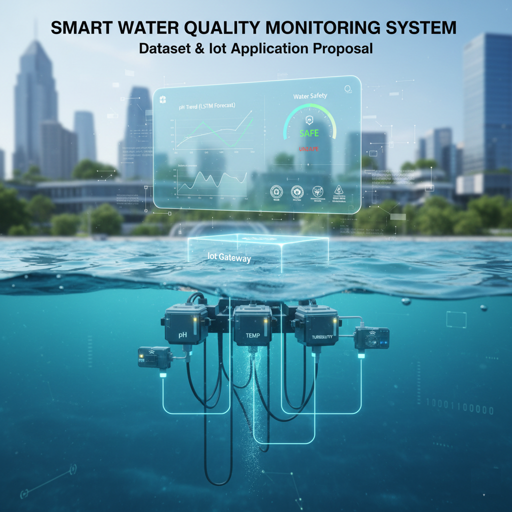

# Smart Water Quality Monitoring Using IoT & Machine Learning



## Project Overview

This project implements a Smart Water Quality Monitoring System using real IoT sensor data from multiple river monitoring stations in Queensland, Australia. The system leverages machine learning to:

1. **Monitor Current Water Quality** - Real-time status visualization
2. **Analyze Historical Trends** - Summary statistics and pattern identification
3. **Predict Future Water Conditions** - LSTM deep learning time series forecasting
4. **Classify Water Safety** - Machine learning classification (Safe/Warning/Unsafe)

## Repository Structure

```
Real_Time_Water_Quality_Data/
│
├── README.md                              # Project documentation (this file)
├── requirements.txt                       # Python dependencies
│
├── archive/                               # Raw IoT sensor data
│   ├── Johnstone_river_coquette_point_joined.csv
│   ├── Johnstone_river_innisfail_joined.csv
│   ├── Mulgrave_river_deeral_joined.csv
│   ├── Pioneer_Dumbleton_joined.csv
│   ├── Plane_ck_sucrogen_joined.csv
│   ├── Proserpine_river_glen_isla_joined.csv
│   ├── russell_river_east_russell_joined.csv
│   ├── sandy_ck_homebush_joined.csv
│   ├── sandy_ck_sorbellos_road_joined.csv
│   ├── Tully_river_euramo_joined.csv
│   └── Tully_River_Tully_Gorge_National_Park_joined.csv
│
├── notebooks/
│   ├── 01_data_exploration_and_cleaning.ipynb   # EDA and data preprocessing
│   ├── 02_lstm_turbidity_prediction.ipynb       # Deep learning time series model
│   └── 03_water_quality_classification.ipynb    # Classification model
│
├── src/
│   ├── data_processing.py                 # Data loading and cleaning utilities
│   ├── lstm_model.py                      # LSTM model architecture
│   ├── classification_model.py            # Classification model
│   └── dashboard_export.py                # Tableau data preparation
│
├── models/                                # Saved model files
│   └── (trained models saved here)
│
├── outputs/                               # Output files for Tableau
│   └── (dashboard-ready CSV files)
│
└── diagrams/
    └── iot_system_design.png              # IoT system architecture diagram
```

## Dataset Description

The dataset contains real-time water quality measurements from 11 IoT monitoring stations across Queensland rivers. Data is collected hourly and includes:

| Variable | Description | Unit |
|----------|-------------|------|
| Timestamp | Date and time of measurement | ISO 8601 |
| Conductivity | Electrical conductivity (indicator of dissolved solids) | µS/cm |
| NO3 | Nitrate concentration | mg/L |
| Q | Water flow/discharge rate | m³/s |
| Temp | Water temperature | °C |
| Turbidity | Water clarity measure | NTU |
| Level | Water level | m |
| Dayofweek | Day of the week (0-6) | - |
| Month | Month of the year (1-12) | - |

## Machine Learning Models

### 1. LSTM Time Series Prediction (Deep Learning)
- **Objective**: Predict future turbidity levels (24-hour forecast)
- **Architecture**: Multi-layer LSTM built from scratch using TensorFlow/Keras
- **Input**: Sequence of past sensor readings (conductivity, temperature, historical turbidity)
- **Output**: Predicted turbidity value for the next 24 hours

### 2. Water Quality Classification
- **Objective**: Classify water quality status as Safe/Warning/Unsafe
- **Model**: Random Forest Classifier with engineered features
- **Features**: Turbidity, Conductivity, Temperature, NO3, and derived features
- **Output**: Classification label with probability scores

## Water Quality Thresholds

Based on Australian water quality guidelines:

| Parameter | Safe | Warning | Unsafe |
|-----------|------|---------|--------|
| Turbidity (NTU) | < 5 | 5-50 | > 50 |
| Conductivity (µS/cm) | < 1500 | 1500-3000 | > 3000 |
| Temperature (°C) | 15-25 | 10-15 or 25-30 | < 10 or > 30 |

## Installation

```bash
# Clone the repository
git clone https://github.com/your-username/Real_Time_Water_Quality_Data.git
cd Real_Time_Water_Quality_Data

# Create virtual environment
python -m venv venv
source venv/bin/activate  # On Windows: venv\Scripts\activate

# Install dependencies
pip install -r requirements.txt
```

## Usage

### 1. Data Exploration and Cleaning
```bash
jupyter notebook notebooks/01_data_exploration_and_cleaning.ipynb
```

### 2. Train LSTM Model
```bash
jupyter notebook notebooks/02_lstm_turbidity_prediction.ipynb
```

### 3. Train Classification Model
```bash
jupyter notebook notebooks/03_water_quality_classification.ipynb
```

### 4. Export Data for Tableau Dashboard
```bash
python src/dashboard_export.py
```

## Tableau Dashboard

The Tableau Public dashboard includes:
1. **Current Status Panel** - Latest sensor readings and safety classification
2. **Historical Summary** - Weekly/monthly trends and statistics
3. **Turbidity Prediction** - LSTM model forecasts
4. **Safety Classification** - Distribution of safe/warning/unsafe readings

**Dashboard Link**: [Tableau Public Dashboard](https://public.tableau.com/your-dashboard-link)

## IoT System Design

See the IoT System Design section in the project report for detailed documentation including:
- Sensor specifications and deployment locations
- Edge processing requirements
- Network architecture (MQTT protocol)
- Cloud data processing pipeline
- Machine learning integration


## License

This project is licensed under the MIT License - see the [LICENSE](LICENSE) file for details.

## References

- Queensland Government Water Monitoring Information Portal
- Australian and New Zealand Guidelines for Fresh and Marine Water Quality
- TensorFlow/Keras Documentation
- Scikit-learn Documentation

